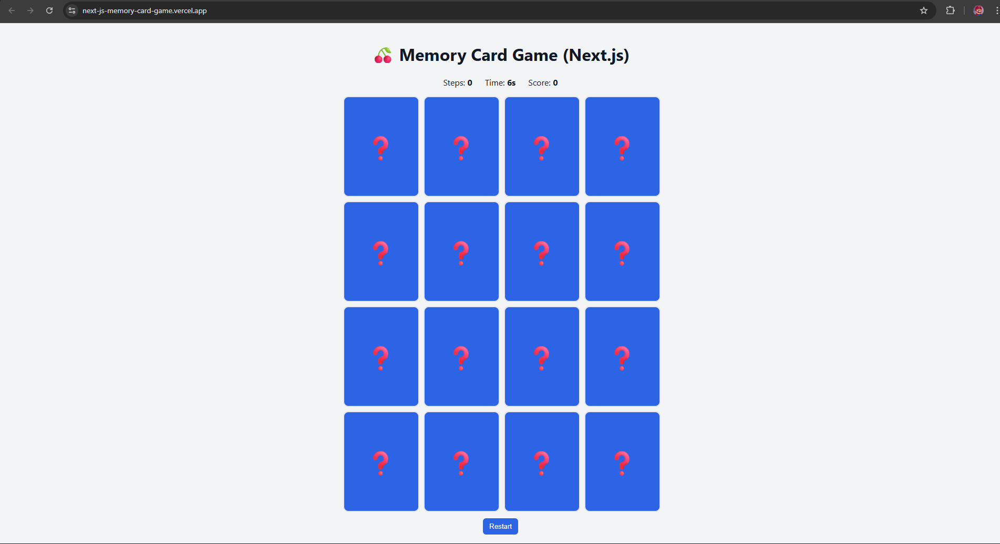

# 🎮 Memory Card Game – Next.js Capstone Project  

**Memory Card Game** adalah mini game berbasis web yang dibuat dengan **Next.js** (React, TypeScript).  
Tujuan permainan ini adalah mencocokkan pasangan kartu dalam grid 4x4 dengan animasi flip, perhitungan langkah, timer, dan skor dinamis.  

Proyek ini dibuat sebagai **Capstone Project**, dengan pemanfaatan **IBM Granite Model (via Hugging Face)** hanya pada fase *development* untuk membantu:  
- Generate kode boilerplate.  
- Optimasi logika permainan (shuffle, timer, skor).  
- Pembuatan dokumentasi.  

> **Catatan:** Granite **tidak digunakan dalam produk final** yang dideploy ke Vercel.  

---

## 🚀 Features  

- 🃏 **Grid 4x4** dengan 16 kartu acak.  
- 🔄 **Flip card animation** dengan efek 3D.  
- ⏱️ **Timer berjalan** (+ penalti skor -10 tiap detik).  
- ✅ **Skor +100** untuk setiap pasangan yang cocok.  
- 🔢 **Step counter** untuk menghitung jumlah percobaan.  
- 🔁 **Restart game** (acak ulang kartu).  
- 📱 **Responsive design** untuk desktop dan mobile.  

---

## 🛠️ Tech Stack  

- **Framework**: Next.js (React 18, App Router)  
- **Language**: TypeScript  
- **Styling**: CSS global (custom) + Flex/Grid  
- **Deployment**: Vercel  
- **AI Assistance (Dev only)**: IBM Granite via Hugging Face Inference API  

---

## 📁 Project Directory Structure

```bash
memory-card-game/
├── app/
│   ├── globals.css          # Global styles
│   ├── layout.tsx           # Root layout with globals.css import
│   └── page.tsx             # Main entry – renders GameBoard
├── components/
│   ├── Card.tsx             # Single card component (flip animation)
│   └── GameBoard.tsx        # Game logic & UI
├── public/                  # Static assets (icons, etc)
├── scripts/                 # Dev-only scripts to call Granite API
│   ├── hf_generate_snippet.js
│   └── hf_optimize_snippet.py
├── next.config.js           # Next.js config
├── package.json
└── README.md
```
---

## 💡 How It Works  

1. **Shuffle cards** → pasangan emoji diacak dengan algoritma Fisher–Yates.  
2. **Flip logic** → klik satu kartu akan membukanya, klik kartu kedua akan dibandingkan:  
   - Jika cocok → tetap terbuka + skor +100.  
   - Jika salah → otomatis tertutup lagi setelah 1 detik.  
3. **Timer berjalan** → +1 detik setiap detik, skor -10 per detik.  
4. **Restart game** → reset langkah, timer, dan skor.  
5. **Win condition** → semua kartu terbuka, timer berhenti.  

---

## ⚙️ How to Run  

1. **Clone repo**:
   ```bash
   git clone <repo-url>
   cd memory-card-game
2. **Install dependencies**:
   ```bash
   npm install
3. **Run locally**:
   ```bash
   npm run dev
   Buka http://localhost:3000
4. **Build for production**:
   ```bash
   npm run build
   npm start

## 🤖 AI Support (Development Only)

Selama pengembangan, IBM Granite digunakan untuk:
- 📝 Membuat boilerplate komponen (Card & GameBoard).
- ⚡ Mengoptimasi fungsi shuffle & timer.
- 📖 Membantu membuat dokumentasi README.
Granite diakses melalui Hugging Face Inference API menggunakan skrip dev (/scripts).
Semua output ditinjau ulang sebelum dipakai.
- 👉 AI tidak dipakai dalam produk final yang dideploy.

## 📸 Sample Gameplay


## 🌍 Contribution to SDG
Proyek ini mendukung SDG 4 – Quality Education dengan menjadi contoh penerapan praktis teknologi AI dalam pendidikan software engineering.

## 📜 License
Silakan gunakan, modifikasi, dan bagikan sesuai kebutuhan.
